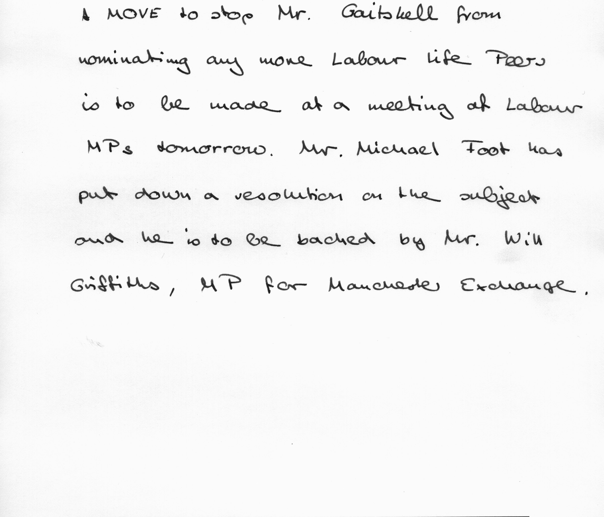
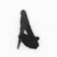
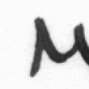
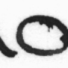
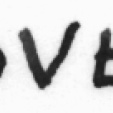

# Handwriting classifier
This project is a text independent author identification model. It is trained and tested on IAM dataset(formsA-D only) with authors having 5 or more pages(considering only 5 pages). It has achieved an accuracy of 99.3% on training set and 86% on validation set.It has following 5 files:
- process_meta_generate_dict.py
- process_dict.py
- strip_and_box_cut.py
- train_test_validate.sh
- classifier.ipynb

### process_meta_generate_dict.py
It is a python script which uses beautiful soup package to process the metadata given with the dataset. It maps writer-id to the list of pages written by the author in a dictionary.

### process_dict.py
This file creates a folder in the directory which contains the categorised pages on the basis of author id. On the basis of the dictionary first 5 pages written by any author is considered for classification. Apart from categorisation, it also uses the opencv library to extract the region of interest from image i.e. it extract a segment of image whose dimensions are obtained by hit and trial.
<figure>

 
<figcation>Origional Image</figcation>
</figure>
<figure>

 
<figcation>Cropped Image</figcation>
</figure>

### strip_and_box_cut.py
It is a script which uses the opencv library of the python to segment extracted region into 113x113 boxes in an effort to make the model text independent. 
<figure>

 
<figcation>Extracted Boxes</figcaption>
</figure>

### train_test_validate.sh
This is a bash script which splits the dataset into training, testing and validation set. It takes one argument which is name of folder. The spilting ratio can be set inside the script. Currently it splits the dataset into 85% training and 15% testing.

### classifier.ipynb
It is the model which is trained on the dataset. It loads images as 64x64. It performs 60 epochs on the training data saving the model after every 10 epochs. The final accuracy scores are 99.3% on training data and 86% on testing data.

## References

1. Linjie Xing, Yu Qiao (2016). DeepWriter: A multi-Stream Deep CNN for Text-independent Writer Identification.
2. [IAM Dataset](https://fki.tic.heia-fr.ch/databases/iam-handwriting-database)
